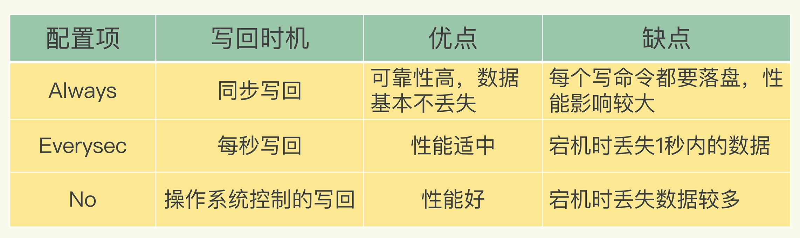

# redis-aof

### 如何实现AOF日志？

AOF日志记录Redis的每个写命令，步骤分为：命令追加（append）、文件写入（write）和文件同步（sync）。

#### 命令追加

当AOF持久化功能打开了，服务器在执行完一个写命令之后，会以协议格式将被执行的写命令追加到服务器的 `aof_buf` 缓冲区。

#### 文件写入和同步

关于何时将 `aof_buf` 缓冲区的内容写入AOF文件中，Redis提供了三种写回策略：

* `Always，同步写回`：每个写命令执行完，立马同步地将日志写回磁盘；
* `Everysec，每秒写回`：每个写命令执行完，只是先把日志写到AOF文件的内存缓冲区，每隔一秒把缓冲区中的内容写入磁盘；
* `No，操作系统控制的写回`：每个写命令执行完，只是先把日志写到AOF文件的内存缓冲区，由操作系统决定何时将缓冲区内容写回磁盘。




为了提高文件写入效率，在现代操作系统中，当用户调用`write`函数，将一些数据写入文件时，操作系统通常会将数据暂存到一个内存缓冲区里，当缓冲区的空间被填满或超过了指定时限后，才真正将缓冲区的数据写入到磁盘里。

这样的操作虽然提高了效率，但也为数据写入带来了安全问题：如果计算机停机，内存缓冲区中的数据会丢失。为此，系统提供了`fsync`、`fdatasync`同步函数，可以强制操作系统立刻将缓冲区中的数据写入到硬盘里，从而确保写入数据的安全性

> redis.conf
>
> ```
> # appendonly参数开启AOF持久化
> appendonly no
>
> # AOF持久化的文件名，默认是appendonly.aof
> appendfilename "appendonly.aof"
>
> # AOF文件的保存位置和RDB文件的位置相同，都是通过dir参数设置的
> dir ./
>
> # 同步策略
> # appendfsync always
> appendfsync everysec
> # appendfsync no
>
> # aof重写期间是否同步
> no-appendfsync-on-rewrite no
>
> # 重写触发配置
> auto-aof-rewrite-percentage 100
> auto-aof-rewrite-min-size 64mb
>
> # 加载aof出错如何处理
> aof-load-truncated yes
>
> # 文件重写策略
> aof-rewrite-incremental-fsync yes
> ```


### aof重写

即合并原有AOF日志中的重复操作，精简aof日志

.png>)

### 拓展

#### 关于AOF重写过程的潜在阻塞风险

前面提到AOF重写不会阻塞，指的是在AOF重写过程不会阻塞主线程，因为是通过后台bgrewriteaof线程来执行的。

但是在fork子进程的时候，fork这个瞬间一定是会阻塞主线程的。

fork采用的是操作系统提供的写时复制（Copy On Write）机制，避免一次性拷贝造成的阻塞。但fork子进程需要拷贝进程必要的数据结构，其中有一项是**拷贝内存页表**（虚拟内存和物理内存的映射索引表），这个拷贝过程会消耗大量的CPU资源，在拷贝完成之前，整个进程是会阻塞的。

拷贝内存页完成后，子进程与父进程指向相同的内存地址空间，也就是说此时虽然产生了子进程，但是并没有申请与父进程相同的内存大小。

那什么时候父子进程才会真正内存分离呢？在写发生时，才真正拷贝内存的数据，这个过程中，父进程也可能会产生阻塞风险。

因为内存分配是以页为单位进行分配的，默认4K，如果父进程此时操作的是一个bigkey，重新申请大块内存耗时会变长，可能会产生阻塞风险。

另外，如果操作系统开启了内存大页机制（Huge Page，页面大小2M），那么父进程申请内存时阻塞的概率将会大大提高，所以在Redis机器上需要关闭Huge Page机制。

#### 为什么AOF重写不复用原AOF日志

有两方面原因：

1. 父子进程写同一个文件会产生竞争问题，影响父进程的性能。
2. 如果AOF重写过程中失败了，相当于污染了原本的AOF文件，无法做恢复数据使用。

#### AOF重写需要手动触发吗？

可以设置自动触发，通过配置这两个参数`auto-aof-rewrite-min-size`和`auto-aof-rewrite-percentage`：

* `auto-aof-rewrite-min-size`：表示运行AOF重写时文件的最小大小，默认为64MB
* `auto-aof-rewrite-percentage`：当前AOF文件大小和上一次重写后AOF文件大小的差值，再除以上一次重写后AOF文件大小

当AOF文件大小同时超出上面两个配置项，会触发AOF重写。
