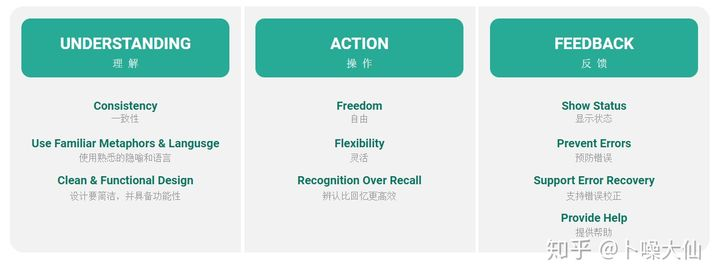

# 尼尔森十大原则

尼尔森十大原则由毕业于哥本哈根的人机交互学博士Jakob Nielsen发表，Jakob Nielsen对人机交互有很多研究，他提出十大可用性原则，用来评价用户体验的好坏，每个产品设计者都可以根据这十大原则进行自查。　

系统可见性原则（Visibility of system status）

　　保持界面的状态可见，变化可见，内容可见。让用户知道发生了什么，在适当的时间内做出适当的反馈。 比如用户在网页上的任何操作，不论是单击、滚动还是按下键盘，页面应即时给出反馈。　

贴近场景原则（Match between system and the real world）

　　用用户的语言，用词，短语和用户熟悉的概念，而不是系统术语。功能操作符合用户的使用用场景。　　

可控性原则（User control and freedom）

　　用户经常错误地选择系统功能而且需要明确标识离开这个的“出口”。比如支持撤销和重做的功能。\[1]　　

一致性和标准化原则（Consistency and standards）

　　遵循平台的惯例。也就是，同一用语、功能、操作保持一致。　

防错原则（Error prevention）

　　更用心的设计防止这类问题发生，在用户可能犯错时进行提醒，比如删除可能造成的后果。　　

协助记忆原则（Recognition rather than recall）

　　尽量减少用户对操作目标的记忆负荷，动作和选项都应该是可见的。用户不必记住一个页面到另一个页面的信息。系统的使用说明应该是可见的或者是容易获取的。　　

灵活高效原则（Flexibility and efficiency of use）

　　 允许用户进行频繁的操作。 更加便捷灵活的代码和反馈.　

审美和简约设计原则（Aesthetic and minimalist design）

　　不应该包含无关紧要的信息。　

容错原则（Help users recognize, diagnose, and recover from errors ）

　　错误信息应该用语言表达（不要用代码），较准确地反应问题所在，并且提出一个建设性的解决方案。比如404。　　

（10）人性化帮助原则（Help and documentation）

　　有必要提供帮助和文档。任何信息应容易去搜索，专注于用户的任务，列出具体的步骤来进行。帮助性提示最好的方式是：1、无需提示；2、一次性提示；3、常驻提示；4；帮助文档。
